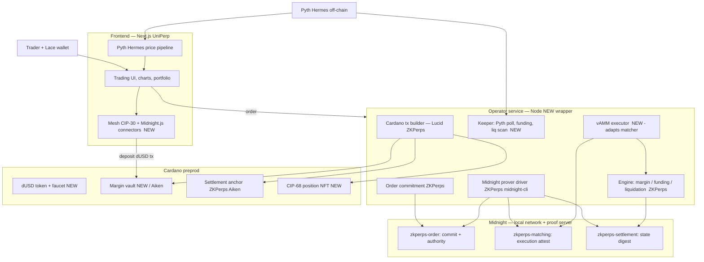

# dorr — Design & Build Spec (v1)

> **dorr** is a privacy-preserving perpetual-futures DEX on **Cardano + Midnight**.
> Its one reason to exist: **your order is invisible to the public mempool, so it cannot be front-run.**
> Built by fusing UniPerp's trading frontend with the Anti-Front-Running-ZKPerps research backend.

**Status:** design locked, pre-build · **Target:** hackathon/grant demo · **Timeline:** ~2-week sprint · **Mode:** everything real, no mocks.

---

## 1. Decisions ledger

| Area | Decision |
|------|----------|
| Purpose | Hackathon/grant demo; north star = *provably hidden order flow* |
| Architecture | Off-chain engine + on-chain privacy (Midnight) + L1 audit anchor (Cardano preprod) |
| Market structure | Oracle-priced **vAMM** with price impact (single trader, no counterparty) |
| Markets (5) | **ADA, BTC, ETH, SOL, DOGE** — all quoted vs **dUSD** |
| Oracle | **Pyth Hermes**, off-chain (display + fills). No on-chain oracle in v1 |
| Privacy | Private order commitments on Midnight; public sees only a 32-byte hash |
| Trust (v1) | **Trusted operator** matches/executes & proves; public is blind. *Not* trustless settlement |
| Collateral | Mock **dUSD** native token + in-app faucet; **real** deposits to a vault; off-chain accounting |
| Positions | **CIP-68 NFT** per open position (optional polish; first to cut) |
| Wallet + libs | **Lace** (Cardano + Midnight) · **Mesh** (CIP-30, frontend) · **Midnight.js** (ZK) · **Lucid** (operator tx) |
| Demo | **A/B**: in-app "public mode" + scripted sandwich bot **vs** dorr invisible |
| Live ZK stages | order → matching → settlement (3 real proofs) on local Midnight; liquidation/aggregate = evidence |
| Demo network | **Local** Midnight network + proof server; **Cardano preprod** anchors (real explorer txs) |
| Cardano access | **Blockfrost** (primary) + **Koios** (keyless fallback) |
| Hosting (demo day) | All local on the laptop; only preprod is remote |
| Max leverage | 20x (inherit UniPerp) |
| Repo | New **`dorr/`** monorepo (bun/pnpm workspaces) |

---

## 2. Trust & privacy model (be honest about this)

**What is hidden, and from whom:**

| Actor | Can they see your order (side/size/leverage/price)? |
|-------|------|
| Public / mempool / MEV bots / other traders | **No** — only a 32-byte SHA-256 commitment + a ZK authority proof on Midnight |
| The dorr operator (matcher/executor) | **Yes** — it receives the revealed preimage to execute against the vAMM |
| Cardano L1 | Sees only settlement **digests** (anchored hashes), never order contents |

**The truthful claim:** *"On a public perp DEX your open-position tx sits in the mempool where searchers can front-run/sandwich it. On dorr the order is a hash on a privacy chain until it's executed — the public cannot see it or trade ahead of it."*

**What we do NOT claim in v1:** trustless settlement, trustless liquidation, or operator-blind matching. The operator is a trusted party (like a sequencer). That is the explicit v1 tradeoff, and the v2 path to remove it is in §9.

---

## 3. System architecture

Five layers. Provenance tags: **[UniPerp]** = ported from `uniperp/web`, **[ZKPerps]** = reused from `Anti-Front-Running-ZKPerps-on-Cardano-w-MidnightZK`, **[NEW]** = built for dorr.



---

## 4. Trade lifecycle (the happy path)

1. **Connect** Lace (Cardano preprod + Midnight). **Faucet** mints test **dUSD**.
2. **Deposit** dUSD → margin **vault** (real preprod tx, user-signed via Mesh/Lace).
3. **Build order** in the UI (market, long/short, size, leverage ≤20x). Client derives a `nonce` and the **commitment** `H = sha256(order‖nonce)` (reuses `src/order/commitment.ts`).
4. **Commit on Midnight** (`zkperps-order`): prove trader authority (ZK), ledger stores only `H`. **← public sees nothing but a hash. This is the anti-front-run moment.**
5. **Reveal** the preimage to the operator over a private channel → operator verifies `sha256(preimage)==H` and attests execution (`zkperps-matching`).
6. **Execute** against the **Pyth-priced vAMM** (mark = Pyth mid; fill = mark ± constant-product price impact on virtual reserves). Engine locks margin, records the position; optional **CIP-68 NFT** minted.
7. **Manage:** keeper applies funding (`funding_rate`) and monitors liquidation (`liquidation_engine`) using off-chain Pyth marks.
8. **Close/settle:** `zkperps-settlement` proves the margin/PnL **digest transition**; operator **anchors the digest** to Cardano preprod via the Aiken `settlement_anchor` (real explorer tx). dUSD PnL settled from the vault.

## 5. A/B demo path (the money shot)

- **Public mode:** same engine, **skip** the Midnight commitment → order is visible → scripted **bot sandwiches** it → trader gets a worse fill (show the slippage).
- **dorr mode:** same order → only `H` appears on Midnight → bot is **blind** → no sandwich possible. Show both panels side by side.

---

## 6. Component inventory — reuse / adapt / build

**Reuse ~as-is**
- **[ZKPerps]** 5 Compact contracts (`contract/src/*.compact`); use order/matching/settlement live.
- **[ZKPerps]** off-chain engine: `settlement/margin_manager.ts`, `funding_rate.ts`, `liquidation_engine.ts`, `settlement_engine.ts`, `src/order/commitment.ts`, `common/types.ts`.
- **[ZKPerps]** Cardano: `cardano/settlement-anchor/` (Aiken), `src/cardano/*`, `settlement/cardano_connector.ts` (Lucid; Blockfrost/emulator).
- **[ZKPerps]** `midnight-local-cli` deploy/prove flow → becomes the operator's prover driver.
- **[UniPerp]** entire Next.js UI (`components/trading`, `dashboard`, charts, providers), and the **Pyth Hermes** pipeline (`lib/events.ts`, `app/api/spot-data`, `hooks/api/use-market-data.ts`) — chain-agnostic, survives the port.

**Adapt**
- **[ZKPerps]** `matching/order_matcher.ts` (order-book) → **vAMM executor** (Pyth price + price impact; port the reserve/impact idea from UniPerp's PerpsHook). `zkperps-matching` repurposed as *execution attestation* (preimage↔commitment) rather than bid/ask crossing.
- **[UniPerp]** `lib/contracts-frontend.ts` (EVM ABIs) → dorr operator **API client** + wallet calls. `lib/core.ts` (wagmi/Unichain) → **Mesh/Lace + Midnight.js** providers. `hooks/api/use-positions.ts`, `use-margin.ts` (viem/ethers) → operator API + user-signed Cardano txs. `wallet-selection-modal` → **Lace/CIP-30**.

**Build new**
- **dUSD** native token (mint policy) + **faucet** endpoint.
- **Margin vault** on Cardano (deposit/withdraw dUSD; v1 may start from the anchor script tightened to operator custody).
- **Operator service** (Node): HTTP API + engine + Midnight proving (proof server) + Lucid Cardano txs + keeper loops.
- **CIP-68** position-NFT minting.
- **A/B "public mode"** toggle + scripted **sandwich bot**.

**Drop**
- **[UniPerp]** Lighthouse zkTLS (`hooks/api/zktls.ts`, Lighthouse bits of `getAMMPrice.ts`), the v0 dashboard mock (`mock.json`). Supabase → optional (keep for price history or use in-memory).

---

## 7. Repo layout (target monorepo)

```
dorr/
  apps/
    web/                     # ported UniPerp frontend (Next.js)
  packages/
    engine/                  # ZKPerps off-chain engine (margin, funding, liq, settlement, commitment, types)
    contracts-compact/       # Midnight Compact contracts + managed artifacts + prover driver
    contracts-aiken/         # dUSD policy, margin vault, settlement anchor, CIP-68 (Aiken/Plutus V3)
  services/
    operator/                # matcher/executor + prover + Cardano tx + keeper + HTTP API
  DESIGN.md
```

Workspaces via bun (repo already uses `bun.lock`). Shared TS types exported from `packages/engine`.

## 8. Runtime processes (all local for the demo)

| Process | Where | Notes |
|---------|-------|-------|
| Next.js web | localhost:3000 | ported UI |
| Operator service | localhost:8787 | engine + prover + Cardano + keeper |
| Midnight proof server | Docker :6300 | `midnightntwrk/proof-server` |
| Local Midnight network | Docker | undeployed net for real proofs |
| Cardano preprod | remote | Blockfrost primary, Koios fallback |
| Lace | browser ext | preprod + Midnight |

---

## 9. Explicit v1 scope — real vs cut

**Real:** dUSD token + real deposits, Midnight proofs (order/matching/settlement) on local net, Cardano preprod anchor txs, Pyth prices, vAMM fills, position NFTs, off-chain engine, Lace wallet, A/B bot.

**Cut / deferred (v2):** trustless on-chain settlement & liquidation → needs **Pyth Lazer on Cardano** (live on mainnet, Aiken SDK, pull model) + an Aiken settlement/liquidation validator; operator-blind matching; live liquidation/aggregate proofs (shown as test evidence in v1); real stablecoins; mainnet; in-browser Midnight proving for user-held privacy (v1 lets the operator prove — it already sees the order, so no extra trust is lost).

---

## 10. Two-week plan

**Week 1 — plumbing & the trade loop (no ZK yet)**
1. Scaffold `dorr/` monorepo; import engine + contracts from ZKPerps; import `web` from UniPerp.
2. Cardano preprod: mint **dUSD** policy + **faucet**; stand up **margin vault**; wire Blockfrost/Koios.
3. Rip EVM out of `web` (wagmi/viem/ethers) → **Lace + Mesh** connect + deposit/withdraw.
4. **Operator service**: wrap the engine; build the **vAMM executor** (Pyth mark + impact); HTTP API.
5. Wire the ported UI to the operator API; **Pyth Hermes** charts + 5 markets; open/close a position end-to-end **without** privacy yet.

**Week 2 — privacy, settlement, demo**
6. Adapt `midnight-local-cli` into the operator; run **order → matching → settlement** proofs on the local Midnight net + proof server, wired into the trade flow.
7. **Anchor** settlement digests to Cardano preprod; verify explorer links.
8. **CIP-68** position NFTs (optional).
9. **A/B**: public-mode toggle + scripted **sandwich bot**; build the side-by-side view.
10. **Harden & rehearse**: pre-warm proof server, fund/keep-warm preprod + local Midnight, script the demo, dry-run repeatedly.

## 11. Top risks & mitigations

| Risk | Mitigation |
|------|-----------|
| Live Midnight proof latency/flakiness on stage | Local net + pre-warmed proof server; rehearse; keep proofs to 3 stages |
| "Everything real, no fallback" bricks mid-demo | Harden each process; run the full pipeline warm before going on; all-local (only preprod remote) |
| vAMM executor is new code | Port impact math from UniPerp PerpsHook; small, well-tested module |
| dUSD/vault custody bugs move real (test) funds | Preprod only; simple vault; operator-signed; cover with the emulator tests first |
| Scope creep | NFTs and liquidation/aggregate proofs are pre-agreed cut lines |

## 12. Open items for build time
- Vault: operator-address custody vs a minimal Aiken validator (decide when building step 2).
- Price history: Supabase vs in-memory (decide when porting the chart pipeline).
- Exact Pyth Hermes feed ids for ADA/BTC/ETH/SOL/DOGE (pull at build).
