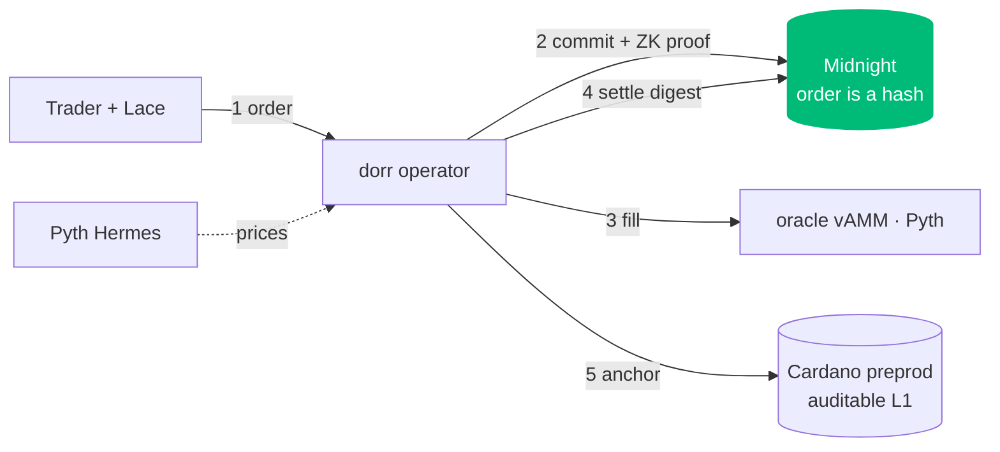

<div align="center">

# dorr

**Perpetual futures you can't front-run.**
Private order flow on **Cardano** + **Midnight** — your order is a zero-knowledge commitment until it settles, so the mempool, MEV bots, and other traders never see it coming.

`ADA · BTC · ETH · SOL · DOGE` · up to 20× · dUSD-margined · settled + audit-anchored on Cardano

</div>

---

## The problem

On every public perp DEX your order sits in the mempool before it executes. Searchers read it, trade ahead of it, and sandwich you. On a leveraged product that timing tax is brutal — and it's structural, not a bug.

## What dorr does

You commit an order as a **SHA-256 commitment on Midnight** with a zero-knowledge proof of validity. The public sees only a 32-byte hash — never the side, size, leverage, or price. It executes against an oracle-priced virtual AMM, and the settlement digest is **anchored on Cardano L1** with an inline datum that reveals nothing but proves it happened.



**The A/B proof:** flip one toggle. In *public* mode the order leaks and a bot sandwiches you (~150 bps stolen). In *dorr* mode the same order is a hash — the bot is blind, you fill fair.

**Real privacy — even from the operator.** A commitment hides your order from the *public*; dorr also hides it from the *operator* with **drand timelock encryption**. Your client seals the order to a future drand round (the League of Entropy — a live 12-of-22 threshold network), so the operator holds only ciphertext and **cannot decrypt it until the batch is frozen** — it never sees your order in time to front-run. *Verified live: the operator's decrypt is refused (`"too early — decryptable at round N"`).*

**Front-running made *impossible*, not just invisible.** dorr clears orders in **uniform-price batch auctions**: every order in an epoch settles at one price, so a bot that inserts a front-run + back-run buys and sells at the *same* price — the sandwich nets **$0 by construction** (live: `$0.00` vs `$152` on a sequential venue). And because a v1 operator custodies collateral, `GET /ops/solvency` publishes an attestation that the **on-chain vault ≥ every credited balance**, verifiable by anyone against the vault address. Plus **commit-time L1 anchoring** (timestamp your commitment on Cardano — provable existence, hidden contents), private limit orders, hidden stop-loss/take-profit (no stop-hunting), selective disclosure, an oracle-divergence guard, per-market open-interest caps, and live exchange stats. Details in [FEATURES.md](./docs/FEATURES.md).

## Proven live

One real run on Cardano **preprod** + a local **Midnight** network — 4 real ZK proofs and 6 on-chain txs, order contents never exposed:

| leg | where | tx |
|---|---|---|
| user-signed vault deposit | preprod | `856ef149…` |
| commit + ZK authority proof | Midnight | `78baabe2…` |
| ZK match attestation | Midnight | `0123d381…` |
| CIP-68 position NFT | preprod | `58262448…` |
| ZK settlement proof | Midnight | `048684da…` |
| **L1 settlement anchor** | preprod | `4b68a747…` |
| ZK Midnight↔Cardano bind | Midnight | `69037ef7…` |
| operator-signed vault withdraw | preprod | `407fc6e4…` |

Full hashes + explorer links in [RUNBOOK.md](./RUNBOOK.md).

## Quickstart

```bash
bun install
./tools/scripts/dev.sh up            # Midnight localnet (docker)
./tools/scripts/dev.sh fund-midnight # once
./tools/scripts/dev.sh operator      # :8790
./tools/scripts/dev.sh web           # :3000
```
Connect Lace (preprod) → faucet dUSD → deposit → trade. To settle on L1, fund the deployer (address + steps in [RUNBOOK.md](./RUNBOOK.md)) and run `./tools/scripts/dev.sh preprod`.

## Architecture

| Path | What |
|---|---|
| `apps/web` | Next.js trading terminal (UniPerp UI) → Mesh/Lace wallet + operator API |
| `services/operator` | 5 markets on Pyth Hermes, vAMM executor, margin/funding/liquidation, ZK job driver, Cardano tx layer, A/B demo |
| `packages/engine` | off-chain perps engine (from the ZKPerps research) |
| `packages/contracts-aiken` | dUSD policy · operator margin vault · settlement anchor (Plutus V3) |
| `vendor/zkperps` | 5 Midnight Compact contracts + per-trade proof drivers |

## Docs

Full docs in [`docs/`](./docs) → [architecture](./docs/ARCHITECTURE.md) (diagrams) · [features](./docs/FEATURES.md) · [Midnight↔Cardano link](./docs/MIDNIGHT_CARDANO.md) · [wallets & setup](./docs/WALLETS.md) · [API & contracts](./docs/API.md) · [security & privacy](./docs/SECURITY.md) · [testing](./docs/TESTING.md).
Also: design rationale in [DESIGN.md](./DESIGN.md) · stage script in [DEMO.md](./DEMO.md) · ops in [RUNBOOK.md](./RUNBOOK.md).

## Testing

79 automated tests (green — 74 operator + 5 engine, covering the **sealed-bid timelock privacy + execution path against LIVE drand**, batch auction, oracle guard, cancel, stats, OI caps, privacy/MEV, auth-crypto, vAMM, CIP-68 emulator) + an assertive on-chain E2E that runs the full commit→execute→close lifecycle with real preprod txs and confirms each on Koios (deposit · faucet · CIP-68 NFT · L1 anchor · vault withdraw). See [docs/TESTING.md](./docs/TESTING.md).

## Honest scope (v1)

dorr's guarantee today is **the public cannot see or front-run your order**, with an **auditable L1 trail**. It is *not yet* trustless: a trusted operator (like a sequencer) does matching/execution and custodies collateral, and the ZK layer attests the pipeline rather than enforcing the trade math on-chain. The path to trustless settlement — Pyth Lazer on Cardano + an Aiken settlement/liquidation validator — is mapped in [DESIGN.md](./DESIGN.md).

## Tech

Cardano · Midnight (Compact ZK) · Aiken (Plutus V3) · Mesh + Lace · Lucid Evolution · Pyth · Next.js · Bun · TypeScript

<div align="center"><sub>Built by fusing UniPerp (perps) with the Anti-Front-Running-ZKPerps research (privacy).</sub></div>
