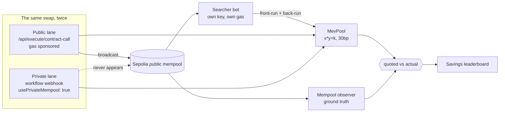
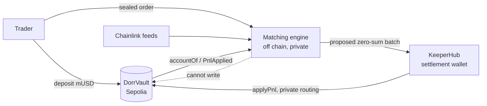

<div align="center">

# dorr

**Private trading, and the receipts.**

Two things that both come down to one idea — what you reveal before a trade
lands is what it costs you.

**MEV Shield** (`/mev`) runs the same swap twice, once through the public
mempool and once through KeeperHub's private routing, and prices the difference
in dollars.

**The perps terminal** (`/`) is a privacy-preserving perpetual futures venue:
sealed orders, hidden stops, collateral in a vault the operator cannot touch,
and PnL settled on chain by KeeperHub rather than by us.

`Ethereum Sepolia` · `KeeperHub` · `Chainlink` · real transaction hashes · nothing simulated

</div>

---

## The claim, and the receipts

Everyone says private transaction routing prevents MEV. Nobody shows you the invoice.

MEV Shield runs a controlled experiment on Sepolia. The same trade, the same pool, the same slippage tolerance, the same signing wallet, the same relayer — back to back, differing in exactly one boolean: whether the transaction touched the public mempool. A real searcher bot watches Sepolia's pending-transaction feed the whole time and sandwiches whatever it can see.

**Sell 10 mETH, 1% slippage tolerance:**

| | Public mempool | Private lane (KeeperHub) |
|---|---|---|
| Quoted | 19,761.64 mUSD | 19,378.22 mUSD |
| **Actually received** | **19,564.03 mUSD** | **19,378.22 mUSD** |
| **Cost of this lane** | **$197.62** | **$0.00** |
| Seen in the public mempool | **yes** — 6.6s before inclusion | **no** — never public |
| Sandwich | **landed** (searcher reacted in 1,466 ms) | none possible |

Every one of these is a real Sepolia transaction:

- victim trade, public lane — [`0x8029cc1b…`](https://sepolia.etherscan.io/tx/0x8029cc1b7b48eedd0e8041e64b7c02d8f8f9542658295ca1f9596fbdbb34e323)
- attacker front-run — [`0xddd85faa…`](https://sepolia.etherscan.io/tx/0xddd85faa7c0d75cad892955705c7dfa5ee105e0f5d05146a4b093afc9acdcbd7)
- attacker back-run — [`0xeedeb67c…`](https://sepolia.etherscan.io/tx/0xeedeb67cc342a2b4616fb2f6776bba99a70287db37aeca41f526b04af97c8d38)
- victim trade, private lane — [`0xdf506b08…`](https://sepolia.etherscan.io/tx/0xdf506b086cc4d2bb25fb7512da3a926eb046864ec1529488fa32ceb8473da131)

**The damage scales with what you disclose.** Same lab, bigger trade and a looser limit:

| Trade | Slippage tolerance | Public mempool | Private lane |
|---|---|---|---|
| 10 mETH | 100 bps | $197.62 | $0.00 |
| 25 mETH | 200 bps | **$972.73** | **$0.00** |

The second one: [victim](https://sepolia.etherscan.io/tx/0xe9ed280bce6c5b64e31bf6f1bc8045e5fbbe64527232e587614c66b48fe8f9cb) · [front-run](https://sepolia.etherscan.io/tx/0x7bc8ec5e7ea657562a158be785bfd9ae7a0272329c8ad79201d846eecd6d184e) · [back-run](https://sepolia.etherscan.io/tx/0x462b9438b38cd15db4a56bb1d8e1d87558a6291505d88d20c122302c956cbff6) · [private](https://sepolia.etherscan.io/tx/0xb373c6edc8787b51bcaafd990a1cadf3c8f328338ce828395c765cae388d7809)

Across every duel run so far: **18 duels, 13 sandwiches landed, $2,550.90 lost to
the public mempool, $2,221.48 saved by the private lane.** Public-lane
transactions were caught in the mempool 17 times out of 18; private-lane
transactions once out of 18 — that one being the very first run, before we
discovered private routing was workflow-only.

The leaderboard on `/mev` is the live version of this paragraph, and it counts
the runs where the searcher *lost* the race too. Those show `$0.00`, and they
stay in the table.

> **KeeperHub submission transaction:** [`0xc67f71a7…`](https://sepolia.etherscan.io/tx/0xc67f71a7029ab41fb735c62b2358a4588db8e7972744fbadd0f394b707d31bd1) — executed via KeeperHub, gas sponsored, receipt independently verified, block 11459375.

---

## Watch it happen

Two things on `/mev` turn the claim from an assertion into something you can
watch:

**The live mempool feed.** Sepolia's pending-transaction stream, as the searcher
sees it, rendered in the page. Run a duel and the public lane's own hash appears
in that stream *before* it is mined. Run the private lane and the same stream
carries on without it. From a real run:

```
20:51:36 ▸ public lane submitting — watch for its hash in the feed
20:51:37   SPOTTED  0x219ae50281d59589be65…   swap on our pool
20:52:02 ▸ private lane submitting — this one should never appear in the feed
           (nothing — 2,778 transactions seen, 1 of them ours)
```

An absence is only convincing next to a presence. That is what the feed is for.

**The autonomous agent.** A KeeperHub **Schedule** workflow executes a real
private swap every hour, unattended — no operator involvement, no button. Each
run is then audited against the operator's own mempool observer: was this hash
ever publicly visible? Runs mined while the observer was offline are reported as
`unobserved` and never counted as a privacy win, because not looking is not the
same as looking and seeing nothing.

That closes the loop on KeeperHub: it *executes* both lanes of a duel, and it
*operates* the agent that keeps producing evidence.

## Why the number is trustworthy

The dollar figure alone would be a just-so story: trades underfill for all sorts of reasons that have nothing to do with MEV. So MEV Shield measures **two** things and only claims an attribution when both line up.

**1. The mechanism — was the transaction actually exposed?**
An independent observer subscribes to Sepolia's `newPendingTransactions` feed and records every hash it sees, with the timestamp it first saw it. "Private routing worked" does not mean an API returned `200`; it means *this log never contained the hash before the block did*. During the run above the observer logged 2,060 pending transactions, so it was demonstrably not asleep — it simply never saw the private one.

**2. The damage — how far below its own quote did the trade fill?**
Each lane is quoted against the reserves standing immediately before its own execution, so the comparison is shortfall-versus-own-quote. Otherwise the second lane would be penalised purely for running second.

The savings rule is deliberately conservative: **a saving is only claimed when both lanes actually executed.** An errored lane contributes `$0` saved, never "the public lane's whole loss." This is pinned by tests, because it is the single easiest way for a project like this to lie.

### Your slippage tolerance is the attacker's budget

The app prices this live. For each tolerance it asks the deployed pool
`maxExtractableFrontRun` — the largest front-run that still lets you clear your
own limit, i.e. the trade a rational searcher actually makes — against current
reserves. On a 10 mETH trade:

| Tolerance | Costs you | Attacker needs | Attacker takes |
|---|---|---|---|
| 0.10% | $10.96 | 0.68 mETH | $6.60 |
| 0.50% | $54.78 | 3.40 mETH | $32.96 |
| **1.00%** *(the usual default)* | **$109.55** | **6.82 mETH** | **$65.85** |
| 3.00% | $328.66 | 20.77 mETH | $196.84 |
| 10.00% | $1,095.54 | 73.21 mETH | $647.45 |

No projection and no gas: every "attacker needs" figure is the contract's own
answer about the real pool. And it agrees with the duels — the curve priced an
8 mETH trade at 100bps as a $87.77 maximum, and the duel that followed measured
$89.88, the gap being the pool drifting between the read and the trade.


The pool exposes `maxExtractableFrontRun(...)`, which solves for the largest front-run that still leaves the victim one wei above their own limit — the trade a rational searcher actually makes. The searcher uses it. That is why a slippage tolerance is not protection: it is a **disclosed budget**. Raise it in the UI and watch the loss grow.

Foundry pins the economics independently of any network:

```
victim loss (USD)        972
attacker profit (USD)    853
to LPs as fees (USD)     118
```

Value is moved, not destroyed — the attacker cannot take more than the victim lost, because the pool skims 30bp off each of the attacker's two legs.

---

## The perps: an operator that cannot pay itself

The trading terminal at `/` is the other half. Orders are sealed until they
clear, stops are never published so they cannot be hunted, and matching happens
off chain — which is the only way any of that privacy works.

That creates an obvious problem, and it is the interesting one: **if the
operator alone knows what everyone is owed, why would you believe it?**

The answer is that the operator is not allowed to pay you.

| | Who controls it | What stops abuse |
|---|---|---|
| Your collateral | `DorrVault` on Sepolia | only the depositor can withdraw; the vault has **no** token-moving admin function |
| Your balance | the vault | the operator reads `accountOf`, it does not write it |
| Your PnL | the engine computes, **KeeperHub applies** | `applyPnl` is gated on KeeperHub's wallet and reverts unless the batch sums to zero |

The operator can decide what you are owed. It cannot credit it. `applyPnl` is
`onlySettlement`, `settlement` is KeeperHub's wallet, and every batch must be
zero-sum — so the operator cannot mint balance, cannot drain the vault, and
cannot pay itself, regardless of what its code says. Settlement is routed
through the **private** mempool, because a settlement batch is a published list
of who closed what and for how much.

The counterparty on the other side of every delta is an insurance fund which is
KeeperHub's own vault account, capitalised by KeeperHub signing its own deposit:
[approve](https://sepolia.etherscan.io/tx/0x4f88775ccc672b769a9f397f43a0d4d73566ef38790049f235b5aac79e79567f) ·
[deposit 50,000 mUSD](https://sepolia.etherscan.io/tx/0x02fc28bb24df3c6246470dc2e02b4001d2d3865c111408c42079d21addfe5304).

Live settlements — all `applyPnl`, all private-routed, all verified on chain:
[`0xe25993b6…`](https://sepolia.etherscan.io/tx/0xe25993b654d7593c8231b45582ddf930693f375d787269f6e542ca837ce37ed5) ·
[`0x8d28d853…`](https://sepolia.etherscan.io/tx/0x8d28d85382741d8cdebf7e3463397375519e96040d6b334d3341698d93ca8489) ·
[`0x77fee2ca…`](https://sepolia.etherscan.io/tx/0x77fee2cabb77c367bb50e25fc480f7864e082f65f59cf77208d4499f0c4bdb70)
— the last one unattended: three positions closed, the keeper batched 2.70 mUSD
five minutes later and pushed it on chain with nobody watching.

**Settlement is idempotent, and it is idempotent for a reason.** The obvious
design decrements a local counter when a batch lands. That works until a batch
lands the operator did not observe — a retry that timed out here but succeeded
there, a restart mid-flight, someone firing the workflow from KeeperHub's own
UI. Then the counter still shows the PnL as owed and the next run pays it
twice. We know because it happened: during development the vault paid
−1.0002 mUSD against −0.5001 owed. So what has been paid is read from the
vault's own `PnlApplied` events and what is owed is the difference. The next
run proposed **+0.5001** — the correction — and the run after that proposed
nothing. Settle twice and the second batch is empty because the arithmetic says
so, not because we remembered correctly.

The terminal shows both numbers side by side, always: *settled on chain* and
*awaiting settlement*. One of them is the vault's word and one is ours, and you
should never have to guess which.

**Prices are Chainlink**, read on chain per market. A feed that cannot be read
disables its market rather than quoting a stale number, because a perp priced
off a guess is worse than a perp that refuses to quote.

```bash
bun run services/operator/src/scripts/prove-deposit.ts 500
```

Mints mUSD, deposits it, and asserts the operator's balance moved to match the
vault's — failing loudly if the two halves ever come apart.

---

## What we learned about KeeperHub

Findings from building this, all verified against the live API. They are written down because each one cost real time.

**Private routing is workflow-only.** `POST /api/execute/contract-call` accepts a `usePrivateMempool` flag, returns `200`, and publishes to the public mempool anyway. We measured it: the "private" transaction appeared in our mempool observer 1.0s before inclusion. Private routing lives on **workflow write-nodes** (`web3/write-contract` with `usePrivateMempool: true`), reachable only through the workflow API.

**Private routing and gas sponsorship are mutually exclusive.** The sponsored REST executor pays your gas. The private workflow path does not — the executing wallet must hold native ETH:

```
Insufficient ETH balance. Have: 0.0, Need: 0.000046160843904.
```

That is a real product trade-off, and MEV Shield reports it rather than hiding it: for small trades the gas can exceed the MEV saved. A tool that told you to route privately regardless of trade size would be selling you something.

**Workflows are created *and* fired with the org key.** The obvious trigger,
`POST /api/workflows/{id}/webhook`, needs a separate `wfb_` credential that only
a browser session can mint — and that session belongs to a *user account*, not
the organisation, so a key minted by one account cannot fire another's workflows
(`403 You do not have permission to run this workflow`). We built a headless SIWE
login to mint one before finding that `POST /api/workflows/{id}/execute` accepts
the `kh_` org key directly. That removed an entire credential, a login flow, and
a class of permission bug. It is not in the obvious place in the API surface.

**`abi` and `functionArgs` must be JSON *strings*, not arrays.** Passing arrays is accepted without complaint and fails much later and much less legibly — an array `abi` is dropped and the API falls back to explorer auto-fetch (*"contract may not be verified"* — misleading, since you supplied one), and an array under `args` encodes as zero arguments (*"types/values length mismatch, count=0"* — reads like a bad ABI). Same trap on workflow nodes, where the symptom is `no matching fragment`.

**`go-live` returns 200 without enabling anything.** Use `PATCH /api/workflows/{id}` with `{enabled: true}`; otherwise the webhook answers `410 Workflow is disabled`.

**A write node with no `integrationId` fails as "exceeded max retries."** The
node needs the id of the web3 integration that signs for it (`GET
/api/integrations`). Omit it and there is nobody to sign as — but the error
names the retry budget, not the missing signer, so it reads like a network
problem. The same generic string also covers a rejected ABI: KeeperHub wants
Foundry's shape, `internalType` included, and quietly refuses the terser
viem-style entry.

**One wallet sends one transaction at a time.** Private routing holds that lock
for as long as inclusion takes — measured here between 12s and 233s — so a
settlement fired while the MEV lab is mid-duel loses the race:

```
Wallet is saturated: could not acquire the nonce lock for 0x7a4f…:11155111 after 120s.
```

That is contention, not failure, and the batch is still owed — so
[`settlement.ts`](services/operator/src/settlement.ts) backs off and asks again
rather than reporting a settlement that did not happen. The structural fix is a
second wallet, which is what KeeperHub's own error message recommends.

**Relayed transactions do not target your contract.** KeeperHub executes through a relayer, wrapping your call as `relayer(account, target, value, bytes(signature ++ innerCalldata))`. A searcher matching on `tx.to == pool` sees nothing — which would make every relayed trade *look* private. [`decodeSwapFromCalldata`](services/operator/src/mev/searcher.ts) scans for the selector and decodes the static words that follow, and is pinned against real relayed transactions in [`mev-searcher.test.ts`](services/operator/test/mev-searcher.test.ts).

---

## Architecture



| Piece | Where |
|---|---|
| Sandwichable AMM + faucet tokens | [`contracts/src/mev/`](contracts/src/mev/) |
| Sandwich economics, proven locally | [`contracts/test/MevPool.t.sol`](contracts/test/MevPool.t.sol) |
| Searcher bot (mempool watcher + attacker) | [`services/operator/src/mev/searcher.ts`](services/operator/src/mev/searcher.ts) |
| Private lane via workflows | [`services/operator/src/mev/private-lane.ts`](services/operator/src/mev/private-lane.ts) |
| The duel (experimental design) | [`services/operator/src/mev/duel.ts`](services/operator/src/mev/duel.ts) |
| Leaderboard + savings rule | [`services/operator/src/mev/store.ts`](services/operator/src/mev/store.ts) |
| Live mempool feed (SSE) | [`services/operator/src/mev/observer.ts`](services/operator/src/mev/observer.ts) |
| Autonomous agent + its audit | [`services/operator/src/mev/scheduled-duel.ts`](services/operator/src/mev/scheduled-duel.ts) |
| Duel database (SQLite) | [`services/operator/src/mev/db.ts`](services/operator/src/mev/db.ts) |
| UI | [`apps/web/components/mev/`](apps/web/components/mev/) → `/mev` |

**The perps**



| Piece | Where |
|---|---|
| Collateral vault (`applyPnl` is `onlySettlement`) | [`contracts/src/DorrVault.sol`](contracts/src/DorrVault.sol) |
| Chain reads + settled-PnL reconciliation | [`services/operator/src/chain.ts`](services/operator/src/chain.ts) |
| Settlement through KeeperHub | [`services/operator/src/settlement.ts`](services/operator/src/settlement.ts) |
| Chainlink index prices | [`services/operator/src/oracle.ts`](services/operator/src/oracle.ts) |
| vAMM, funding, liquidation, hidden stops | [`services/operator/src/trading.ts`](services/operator/src/trading.ts) |
| Sealed-bid batch clearing | [`services/operator/src/sealbid.ts`](services/operator/src/sealbid.ts) |
| One-time settlement wiring | [`services/operator/src/scripts/provision-settlement.ts`](services/operator/src/scripts/provision-settlement.ts) |
| UI | [`apps/web/components/trading/`](apps/web/components/trading/) → `/` |

**Deployed on Sepolia**

| Contract | Address |
|---|---|
| MevPool | [`0xb261e0df84a14ec7bb698f986b65b8a27d1b50e1`](https://sepolia.etherscan.io/address/0xb261e0df84a14ec7bb698f986b65b8a27d1b50e1) |
| mETH (faucet) | [`0x67427ce5d1e36f701d91d52917834faf1bd57f24`](https://sepolia.etherscan.io/address/0x67427ce5d1e36f701d91d52917834faf1bd57f24) |
| mUSD (faucet) | [`0xb3670c1663cdc5ef6bd1dbec1770323bfb86a910`](https://sepolia.etherscan.io/address/0xb3670c1663cdc5ef6bd1dbec1770323bfb86a910) |
| Searcher (adversary) | [`0x937749eFFbB83FDC704417Aab2D5C5C4ba0CCdf7`](https://sepolia.etherscan.io/address/0x937749eFFbB83FDC704417Aab2D5C5C4ba0CCdf7) |
| DorrVault (perps collateral) | [`0xff236fb4890e4fd2916c4a910810810a1d120ca5`](https://sepolia.etherscan.io/address/0xff236fb4890e4fd2916c4a910810810a1d120ca5) |
| Settlement + insurance fund (KeeperHub) | [`0x7a4fdd120a17e5390d87565e74a3fbf80df05fc1`](https://sepolia.etherscan.io/address/0x7a4fdd120a17e5390d87565e74a3fbf80df05fc1) |

The perps take margin in the same `mUSD` the lab prices, so one faucet funds
both halves of the app. Index prices come from Chainlink's Sepolia aggregators —
ETH/USD [`0x694AA176…`](https://sepolia.etherscan.io/address/0x694AA1769357215DE4FAC081bf1f309aDC325306),
BTC/USD [`0x1b44F351…`](https://sepolia.etherscan.io/address/0x1b44F3514812d835EB1BDB0acB33d3fA3351Ee43),
LINK/USD [`0xc59E3633…`](https://sepolia.etherscan.io/address/0xc59E3633BAAC79493d908e63626716e204A45EdF),
DAI/USD [`0x14866185…`](https://sepolia.etherscan.io/address/0x14866185B1962B63C3Ea9E03Bc1da838bab34C19).

Both tokens have a permissionless `mint` so anyone can reproduce the experiment. `mUSD` is an 18-decimal USD stand-in — 1 mUSD := $1 — so a base→quote shortfall is already denominated in dollars, with no oracle in the trust path.

---

## Run it

```bash
cd contracts && forge test -vv
```

That proves the sandwich economics locally — no network, no keys.

For the live app you need a KeeperHub org key, a Sepolia-funded deployer, and
about 0.05 Sepolia ETH:

```bash
cp .env.example .env   # fill in ETH_DEPLOYER_KEY and KEEPERHUB_API_KEY
```

```bash
cd services/operator && bun run src/scripts/mev-deploy.ts
```

```bash
bun run --cwd services/operator start
```

```bash
bun run --cwd apps/web dev
```

Open the app and press **Run the duel**. No wallet, no connect step — the trade
executes from KeeperHub's own wallet, so a judge can click it on first load.

Optional — stand up the autonomous agent, then watch its audit trail in the app:

```bash
cd services/operator && bun run src/scripts/mev-schedule.ts "0 * * * *" 2 100
```

Between runs, `mev-rebalance.ts` arbitrages the pool back to its target price;
every duel leaves it slightly off, since the searcher's two legs don't cancel
against the 30bp fee.

For the perps, wire settlement once — this capitalises the insurance fund by
having KeeperHub sign its own deposit, and hands it the vault's settlement
authority:

```bash
cd services/operator && bun run src/scripts/provision-settlement.ts 50000
```

Then trade at `/`. Connect a wallet on Sepolia, press **Get mUSD** (a real
permissionless `mint`), deposit, and open a position. Realized PnL appears as
*awaiting settlement* and the keeper batches it on chain every five minutes.

## Honest limitations

- **The searcher is ours.** No independent searcher fleet hunts a bespoke pool on a testnet, so we run the adversary ourselves. Its attacks are real signed transactions paid for with its own ETH, racing for block position on priority fee — but it is not evidence about how crowded mainnet MEV is.
- **The pool is ours too**, and nobody else trades it. That is what makes the counterfactual clean; it is not a claim about real venue depth.
- **Sample size is small.** The leaderboard reports exactly what happened across the duels that have been run. Nothing is annualised or extrapolated.
- **A lost race is reported as a lost race.** If the searcher fails to land the sandwich, the public lane shows the loss it actually took — which is sometimes $0.
- **The searcher can run out of gas.** It bids 25× the victim's priority fee and pays from its own wallet, so a long session drains it — after which it stops landing attacks and the public lane starts reporting $0. That is the most flattering way this lab can be wrong, so `/mev/status` reports the searcher's balance and the UI warns when it can no longer attack. Top it up with `mev-deploy.ts`, which is idempotent.
- **The scheduled agent is private-lane-only.** Driving a full two-lane duel on a cron would need KeeperHub to call this operator inbound, and its outbound-webhook action requires a paid plan (`402`). The agent therefore performs the private swap itself — no inbound reachability needed — so the unattended evidence covers privacy, while the public-lane comparison is run from the app.
- **Private-lane gas is not sponsored**, so a full accounting for small trades should net gas against MEV saved. The UI does not currently do that subtraction.
- **The perps' matching engine is trusted.** Orders are sealed from other traders and stops are hidden from everyone, but the operator sees the book — that is what makes the matching possible. What the operator provably *cannot* do is touch collateral or credit PnL: both are gated on contracts it does not control. Making the matching itself verifiable would need a proof system, which this does not have.
- **Settlement and the MEV lab share one KeeperHub wallet**, so they contend for its nonce lock. Settlement backs off and retries, which is correct but slow under load; the real fix is a second wallet.
- **The insurance fund is capitalised from a testnet faucet.** It is real capital in the real vault and the zero-sum invariant is genuinely enforced, but 50,000 mUSD is not a solvency argument for a live venue.

---

## Provenance

`dorr` began as a privacy-preserving perpetuals venue on Flare, margined in FXRP
and priced by the FTSO. Both halves now run on Ethereum Sepolia through
KeeperHub: the oracle is Chainlink, the collateral is mUSD, and the settlement
authority the perps always needed is KeeperHub's wallet rather than a relayer of
our own. The Cardano/Midnight subsystem is gone entirely.

What remains is on one chain, and every headline number has a transaction hash
behind it. The one thing that is *computed* rather than measured — the Attack
Lab, which solves a sandwich against the live vAMM curve without sending
anything — is labelled as a model wherever it appears, and points at the duel
that measures the same attack for real.

Inspired by Nucast's [Anti-Front-Running-ZKPerps-on-Cardano-w-MidnightZK](https://github.com/nucastio/Anti-Front-Running-ZKPerps-on-Cardano-w-MidnightZK).

A separate write-up of the integration experience — reproducible issues with
proposed fixes, submitted for the onboarding-UX bounty — is in
[`docs/keeperhub-onboarding-friction.md`](docs/keeperhub-onboarding-friction.md).
