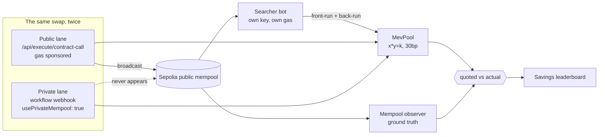

<div align="center">

# MEV Shield

**The private lane, measured.**

Run the same swap twice — once through the public mempool, once through KeeperHub's private routing — and price the difference in dollars.

`Ethereum Sepolia` · `KeeperHub` · real sandwich attacks · real transaction hashes

</div>

---

## The claim, and the receipts

Everyone says private transaction routing prevents MEV. Nobody shows you the invoice.

MEV Shield runs a controlled experiment on Sepolia. The same trade, the same pool, the same slippage tolerance, the same signing wallet, the same relayer — back to back, differing in exactly one boolean: whether the transaction touched the public mempool. A real searcher bot watches Sepolia's pending-transaction feed the whole time and sandwiches whatever it can see.

**Sell 10 mETH, 1% slippage tolerance:**

| | Public mempool | Private lane (KeeperHub) |
|---|---|---|
| Quoted | 19,761.64 mUSD | 19,378.22 mUSD |
| **Actually received** | **19,564.03 mUSD** | **19,378.22 mUSD** |
| **Cost of this lane** | **$197.62** | **$0.00** |
| Seen in the public mempool | **yes** — 6.6s before inclusion | **no** — never public |
| Sandwich | **landed** (searcher reacted in 1,466 ms) | none possible |

Every one of these is a real Sepolia transaction:

- victim trade, public lane — [`0x8029cc1b…`](https://sepolia.etherscan.io/tx/0x8029cc1b7b48eedd0e8041e64b7c02d8f8f9542658295ca1f9596fbdbb34e323)
- attacker front-run — [`0xddd85faa…`](https://sepolia.etherscan.io/tx/0xddd85faa7c0d75cad892955705c7dfa5ee105e0f5d05146a4b093afc9acdcbd7)
- attacker back-run — [`0xeedeb67c…`](https://sepolia.etherscan.io/tx/0xeedeb67cc342a2b4616fb2f6776bba99a70287db37aeca41f526b04af97c8d38)
- victim trade, private lane — [`0xdf506b08…`](https://sepolia.etherscan.io/tx/0xdf506b086cc4d2bb25fb7512da3a926eb046864ec1529488fa32ceb8473da131)

**The damage scales with what you disclose.** Same lab, bigger trade and a looser limit:

| Trade | Slippage tolerance | Public mempool | Private lane |
|---|---|---|---|
| 10 mETH | 100 bps | $197.62 | $0.00 |
| 25 mETH | 200 bps | **$972.73** | **$0.00** |

The second one: [victim](https://sepolia.etherscan.io/tx/0xe9ed280bce6c5b64e31bf6f1bc8045e5fbbe64527232e587614c66b48fe8f9cb) · [front-run](https://sepolia.etherscan.io/tx/0x7bc8ec5e7ea657562a158be785bfd9ae7a0272329c8ad79201d846eecd6d184e) · [back-run](https://sepolia.etherscan.io/tx/0x462b9438b38cd15db4a56bb1d8e1d87558a6291505d88d20c122302c956cbff6) · [private](https://sepolia.etherscan.io/tx/0xb373c6edc8787b51bcaafd990a1cadf3c8f328338ce828395c765cae388d7809)

Across every duel run so far: **4 duels, 3 sandwiches landed, $1,360.16 lost to the public
mempool, $1,170.34 saved by the private lane.** Public-lane transactions were caught in the
mempool 4 times out of 4; private-lane transactions once out of 4 — that one being the first
run, before we discovered private routing was workflow-only.

> **KeeperHub submission transaction:** [`0xc67f71a7…`](https://sepolia.etherscan.io/tx/0xc67f71a7029ab41fb735c62b2358a4588db8e7972744fbadd0f394b707d31bd1) — executed via KeeperHub, gas sponsored, receipt independently verified, block 11459375.

---

## Why the number is trustworthy

The dollar figure alone would be a just-so story: trades underfill for all sorts of reasons that have nothing to do with MEV. So MEV Shield measures **two** things and only claims an attribution when both line up.

**1. The mechanism — was the transaction actually exposed?**
An independent observer subscribes to Sepolia's `newPendingTransactions` feed and records every hash it sees, with the timestamp it first saw it. "Private routing worked" does not mean an API returned `200`; it means *this log never contained the hash before the block did*. During the run above the observer logged 2,060 pending transactions, so it was demonstrably not asleep — it simply never saw the private one.

**2. The damage — how far below its own quote did the trade fill?**
Each lane is quoted against the reserves standing immediately before its own execution, so the comparison is shortfall-versus-own-quote. Otherwise the second lane would be penalised purely for running second.

The savings rule is deliberately conservative: **a saving is only claimed when both lanes actually executed.** An errored lane contributes `$0` saved, never "the public lane's whole loss." This is pinned by tests, because it is the single easiest way for a project like this to lie.

### Your slippage tolerance is the attacker's budget

The pool exposes `maxExtractableFrontRun(...)`, which solves for the largest front-run that still leaves the victim one wei above their own limit — the trade a rational searcher actually makes. The searcher uses it. That is why a slippage tolerance is not protection: it is a **disclosed budget**. Raise it in the UI and watch the loss grow.

Foundry pins the economics independently of any network:

```
victim loss (USD)        972
attacker profit (USD)    853
to LPs as fees (USD)     118
```

Value is moved, not destroyed — the attacker cannot take more than the victim lost, because the pool skims 30bp off each of the attacker's two legs.

---

## What we learned about KeeperHub

Findings from building this, all verified against the live API. They are written down because each one cost real time.

**Private routing is workflow-only.** `POST /api/execute/contract-call` accepts a `usePrivateMempool` flag, returns `200`, and publishes to the public mempool anyway. We measured it: the "private" transaction appeared in our mempool observer 1.0s before inclusion. Private routing lives on **workflow write-nodes** (`web3/write-contract` with `usePrivateMempool: true`), reachable only through the workflow API.

**Private routing and gas sponsorship are mutually exclusive.** The sponsored REST executor pays your gas. The private workflow path does not — the executing wallet must hold native ETH:

```
Insufficient ETH balance. Have: 0.0, Need: 0.000046160843904.
```

That is a real product trade-off, and MEV Shield reports it rather than hiding it: for small trades the gas can exceed the MEV saved. A tool that told you to route privately regardless of trade size would be selling you something.

**Three different credentials, not interchangeable.**

| Credential | What it can do |
|---|---|
| `kh_*` org API key | `/api/execute/*`, `/mcp`, reading and creating workflows |
| `wfb_*` webhook key | fire a workflow (`POST /api/workflows/{id}/webhook`) |
| browser session cookie | mint keys (`/api/api-keys`), account settings |

The `wfb_` key can only be minted with the cookie. [`kh-session.ts`](services/operator/src/mev/kh-session.ts) obtains one headlessly over SIWE so the whole pipeline stays automatable.

**`abi` and `functionArgs` must be JSON *strings*, not arrays.** Passing arrays is accepted without complaint and fails much later and much less legibly — an array `abi` is dropped and the API falls back to explorer auto-fetch (*"contract may not be verified"* — misleading, since you supplied one), and an array under `args` encodes as zero arguments (*"types/values length mismatch, count=0"* — reads like a bad ABI). Same trap on workflow nodes, where the symptom is `no matching fragment`.

**`go-live` returns 200 without enabling anything.** Use `PATCH /api/workflows/{id}` with `{enabled: true}`; otherwise the webhook answers `410 Workflow is disabled`.

**Relayed transactions do not target your contract.** KeeperHub executes through a relayer, wrapping your call as `relayer(account, target, value, bytes(signature ++ innerCalldata))`. A searcher matching on `tx.to == pool` sees nothing — which would make every relayed trade *look* private. [`decodeSwapFromCalldata`](services/operator/src/mev/searcher.ts) scans for the selector and decodes the static words that follow, and is pinned against real relayed transactions in [`mev-searcher.test.ts`](services/operator/test/mev-searcher.test.ts).

---

## Architecture



| Piece | Where |
|---|---|
| Sandwichable AMM + faucet tokens | [`contracts/src/mev/`](contracts/src/mev/) |
| Sandwich economics, proven locally | [`contracts/test/MevPool.t.sol`](contracts/test/MevPool.t.sol) |
| Searcher bot (mempool watcher + attacker) | [`services/operator/src/mev/searcher.ts`](services/operator/src/mev/searcher.ts) |
| Private lane via workflows | [`services/operator/src/mev/private-lane.ts`](services/operator/src/mev/private-lane.ts) |
| The duel (experimental design) | [`services/operator/src/mev/duel.ts`](services/operator/src/mev/duel.ts) |
| Leaderboard + savings rule | [`services/operator/src/mev/store.ts`](services/operator/src/mev/store.ts) |
| UI | [`apps/web/components/mev/`](apps/web/components/mev/) → `/mev` |

**Deployed on Sepolia**

| Contract | Address |
|---|---|
| MevPool | [`0xb261e0df84a14ec7bb698f986b65b8a27d1b50e1`](https://sepolia.etherscan.io/address/0xb261e0df84a14ec7bb698f986b65b8a27d1b50e1) |
| mETH (faucet) | [`0x67427ce5d1e36f701d91d52917834faf1bd57f24`](https://sepolia.etherscan.io/address/0x67427ce5d1e36f701d91d52917834faf1bd57f24) |
| mUSD (faucet) | [`0xb3670c1663cdc5ef6bd1dbec1770323bfb86a910`](https://sepolia.etherscan.io/address/0xb3670c1663cdc5ef6bd1dbec1770323bfb86a910) |
| Searcher (adversary) | [`0x937749eFFbB83FDC704417Aab2D5C5C4ba0CCdf7`](https://sepolia.etherscan.io/address/0x937749eFFbB83FDC704417Aab2D5C5C4ba0CCdf7) |

Both tokens have a permissionless `mint` so anyone can reproduce the experiment. `mUSD` is an 18-decimal USD stand-in — 1 mUSD := $1 — so a base→quote shortfall is already denominated in dollars, with no oracle in the trust path.

---

## Run it

```bash
cd contracts && forge test --match-contract MevPoolTest -vv
```

That proves the sandwich economics locally, no network or keys required.

For the live duel you need a KeeperHub org key, a Sepolia-funded deployer, and about 0.05 Sepolia ETH:

```bash
cp .env.example .env   # fill in ETH_DEPLOYER_KEY and KEEPERHUB_API_KEY
```

```bash
cd services/operator && bun run src/scripts/keeperhub-onboard.ts
```

```bash
cd services/operator && bun run src/scripts/mev-deploy.ts
```

```bash
cd services/operator && bun run src/scripts/mev-duel.ts 10 100
```

Then the UI:

```bash
bun run --cwd services/operator start
```

```bash
bun run --cwd apps/web dev
```

`/mev` renders the duel, both lanes, and the leaderboard. Between runs, `mev-rebalance.ts` arbitrages the pool back to its target price — every duel leaves it slightly off, since the searcher's two legs don't perfectly cancel against the 30bp fee.

---

## Honest limitations

- **The searcher is ours.** No independent searcher fleet hunts a bespoke pool on a testnet, so we run the adversary ourselves. Its attacks are real signed transactions paid for with its own ETH, racing for block position on priority fee — but it is not evidence about how crowded mainnet MEV is.
- **The pool is ours too**, and nobody else trades it. That is what makes the counterfactual clean; it is not a claim about real venue depth.
- **Sample size is small.** The leaderboard reports exactly what happened across the duels that have been run. Nothing is annualised or extrapolated.
- **A lost race is reported as a lost race.** If the searcher fails to land the sandwich, the public lane shows the loss it actually took — which is sometimes $0.
- **Private-lane gas is not sponsored**, so a full accounting for small trades should net gas against MEV saved. The UI does not currently do that subtraction.

---

## Provenance

Built on the `dorr` codebase — a privacy-preserving perpetuals venue (sealed orders via drand timelock, uniform-price batch auctions, TEE-attested settlement). MEV Shield reuses its operator, job system, and design language, and replaces the simulated attack lab with one that runs on chain.

Inspired by Nucast's [Anti-Front-Running-ZKPerps-on-Cardano-w-MidnightZK](https://github.com/nucastio/Anti-Front-Running-ZKPerps-on-Cardano-w-MidnightZK).

A separate write-up of the integration experience — six reproducible issues with proposed
fixes, submitted for the onboarding-UX bounty — is in
[`docs/keeperhub-onboarding-friction.md`](docs/keeperhub-onboarding-friction.md).
