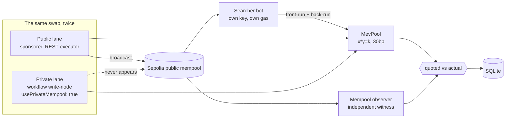
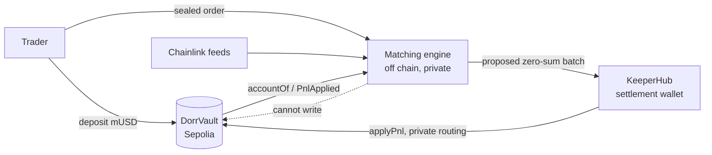

# Architecture

Two subsystems sharing one operator, one chain, and one faucet token.

**MEV Shield** measures what the public mempool costs you. **The perps** build a
venue where you never have to enter it. Both run on Ethereum Sepolia and execute
through KeeperHub.

---

## The operator

A single Hono server on Bun (`services/operator`). It is stateful, and
deliberately so — but the state it owns is carefully bounded:

| State | Where it lives | Who can change it |
|---|---|---|
| Duel history | SQLite (`data/mev.db`) | the operator |
| Orders, positions, jobs | JSON (`data/state.json`) | the operator |
| **Collateral** | `DorrVault` on Sepolia | **only the depositor** |
| **Settled PnL** | `DorrVault` on Sepolia | **only KeeperHub** |

The bottom two rows are the load-bearing ones. Everything the operator can
change is either a measurement it published or bookkeeping it must reconcile
against the chain.

---

## MEV Shield

The experimental design is the point. Both lanes are the same swap, the same
pool, the same signing wallet, the same relayer — differing in exactly one
boolean. Anything else and the comparison would prove nothing.

Three parts are worth understanding:

**The searcher is a real adversary.** Its own key, its own ETH, bidding priority
fee for block position against a live mempool feed. It loses races, and when it
does the duel records `$0.00` rather than hiding the run.

**The observer is an independent witness.** It subscribes to pending
transactions and is not involved in sending either lane, so "this hash was never
public" is a claim something other than the sender can check. Transactions mined
while it was disconnected are reported as *unobserved*, never as private.

**Relayed transactions don't target the pool.** KeeperHub executes through a
relayer, wrapping the call as `relayer(account, target, value, bytes)`. A
searcher matching on `tx.to == pool` sees nothing — which would make every
relayed trade *look* private. `decodeSwapFromCalldata` scans for the selector
instead, and is pinned against real relayed transactions in the tests.

---

## The perps

Read the dotted arrow first: **the engine cannot write to the vault.** It reads
balances and it proposes settlements. `applyPnl` is `onlySettlement`,
`settlement` is KeeperHub's wallet, and every batch must sum to zero.

The rest follows from that constraint:

**Orders are commitments.** `SHA-256(fields ‖ 128-bit nonce)` is published; the
fields are not. Sealed orders add a drand timelock so the operator itself can't
read them before the epoch clears.

**Prices are Chainlink**, read on chain per market. A feed that can't be read
disables its market.

**Execution is a vAMM** seeded from the index and recentred as it drifts. The
pool is seeded *before* the port opens — an order commits against the oracle but
fills against the pool, so a pool that doesn't exist yet would accept a commit
and then strand the margin behind an order that can never fill.

**Settlement is batched and idempotent.** What has been paid is read from the
vault's own `PnlApplied` events; what is owed is the difference. Settle twice
and the second batch is empty because the arithmetic says so, not because the
operator remembered correctly.

---

## Why they share a token

`mUSD` is the collateral for the perps and the quote asset for the MEV pool. Its
`mint` is permissionless, so one faucet funds both halves and anyone can
reproduce either experiment without asking us for testnet tokens.

It is an 18-decimal dollar stand-in — 1 mUSD := $1 — so a base→quote shortfall
is already denominated in dollars with no oracle in the trust path. That matters
for MEV Shield specifically: the headline number doesn't depend on a price feed
being right.

---

## Layout

| Path | What |
|---|---|
| `contracts/src/mev/` | `MevPool` (sandwichable AMM), `MevToken` (open faucet) |
| `contracts/src/DorrVault.sol` | collateral + zero-sum `applyPnl` |
| `services/operator/src/mev/` | searcher, observer, duel runner, private lane, SQLite |
| `services/operator/src/` | perps engine, Chainlink oracle, vAMM, settlement |
| `apps/web/` | Next.js app — `/` perps terminal, `/mev` MEV Shield |
| `packages/engine/` | the order-commitment primitive, shared by both |
