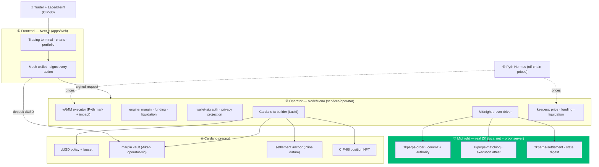
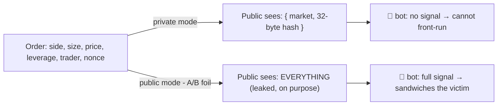
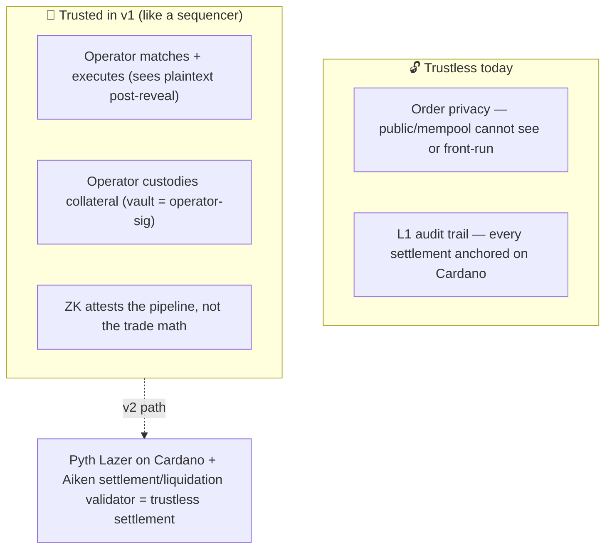

# 🏗️ Architecture

dorr fuses two things that normally don't meet: a **real perps trading app** (UniPerp's UI + engine) and a **ZK privacy layer** (the Anti-Front-Running-ZKPerps research on Midnight). The result is a perp where your order is a zero-knowledge commitment until it settles.

## The five layers



| Layer | Package | Real vs stub |
|-------|---------|--------------|
| Frontend | `apps/web` | ported UniPerp premium UI, EVM ripped out, Mesh/Lace + operator client |
| Operator | `services/operator` | vAMM, accounting, auth, ZK driver, Cardano tx, keepers, A/B demo |
| Engine | `packages/engine` | off-chain perps engine from the ZKPerps research (margin/funding/liquidation/commitment) |
| Compact | `vendor/zkperps` + `dorr-*` drivers | 5 real Midnight Compact contracts + per-trade proof drivers |
| Aiken | `packages/contracts-aiken` | dUSD policy · margin vault · settlement anchor (Plutus V3, `aiken build` green) |

## A trade, end to end

```mermaid
sequenceDiagram
  autonumber
  participant U as Trader (wallet)
  participant O as Operator
  participant M as Midnight (ZK)
  participant C as Cardano preprod
  participant P as Public feed

  U->>C: deposit dUSD to vault (user-signed)
  U->>O: commit {market,side,size,lev} + wallet signature
  O->>M: deploy zkperps-order + proveTraderOrderAuthority (ZK)
  O->>P: publish ONLY the 32-byte commitment hash
  Note over P: 🔒 side/size/price/leverage hidden — bots see nothing
  U->>O: execute
  O->>O: fill on the oracle-priced vAMM
  O->>M: proveAndFinalizeMatch (ZK, execution attest)
  O->>C: mint CIP-68 position NFT
  U->>O: close
  O->>M: proveSettlementTransition (ZK)
  O->>C: anchor settlement digest (inline datum)
  O->>M: bindL1SettlementAnchor (ZK, Midnight↔Cardano)
  O->>U: PnL settled in dUSD; withdraw available
```

Every step above is **real** — [proven on-chain](./TESTING.md#on-chain-e2e) with 4 ZK proofs and 6 preprod txs in one run.

## The privacy boundary

The single source of truth for "what the public can see" is one pure function, `publicFeedView` (`services/operator/src/privacy.ts`), pinned by tests:



The commitment is `SHA-256(pairId, side, price, size, leverage, margin, nonce)` — hiding (no field is recoverable) and binding (any change alters the hash). Brute-forcing the 128-bit nonce is infeasible. See [SECURITY](./SECURITY.md).

## The oracle-priced vAMM

Ported from UniPerp's constant-product model: virtual reserves, price impact on fills, and a keeper that re-centers the pool to the Pyth index. One trader can open a leveraged long/short with no counterparty; the A/B demo can run a *real* sandwich on it (then restore the pool).

```
mark = virtualQuote / virtualBase        (constant product: base × quote = k)
fill walks the curve → price impact       LONG buys base (price ↑), SHORT sells (price ↓)
keeper recenters to Pyth when drift > 5bps
```

## Trust model (read this)



We claim **"the public can't see or front-run your order"** — not "trustless perp." That distinction is deliberate and documented; see [SECURITY → honest scope](./SECURITY.md#honest-scope).

## Runtime processes

| Process | Port | Notes |
|---------|------|-------|
| web (Next.js) | 3000 | premium trading terminal |
| operator (Hono) | 8790 | the brain |
| Midnight proof server | 6301 | real ZK proofs |
| Midnight indexer (GraphQL v3) | 8088 | local net |
| Midnight node RPC | 9945 | local net |
| Cardano preprod | remote | Blockfrost primary, keyless Koios fallback |
