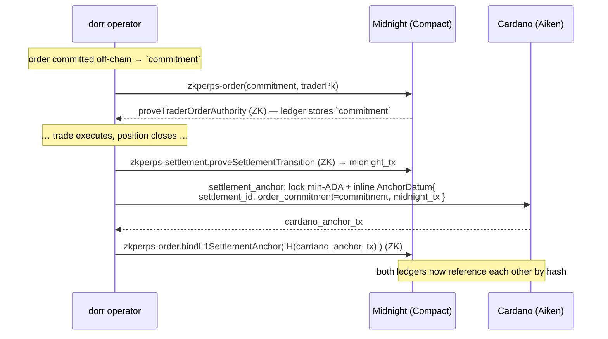

# 🔗 How Midnight and Cardano are connected

Short version: **two separate ledgers, linked by a shared cryptographic digest** that appears on both — not a token bridge, not a light-client, not a state proof. The operator orchestrates a **two-way hash reference** so anyone can later verify the two chains agree.

## Why there's no direct bridge

Midnight and Cardano are **independent ledgers with independent consensus**. Midnight is a Cardano *partner chain* — it can be validated by Cardano SPOs, but a Compact contract **cannot read Cardano state**, and a Plutus validator **cannot read Midnight state**. There is no native message-passing. So dorr connects them the honest way: it commits the **same 32-byte digest** on both sides, and records each side's transaction on the other.

## The shared digest

Everything hangs off one value, computed off-chain when you place an order:

```
commitment = SHA-256( pairId, side, price, size, leverage, margin, nonce )   // 32 bytes
```

That single hash is the thread stitched through both chains.

## The two-way link, step by step



1. **Midnight commits the hash.** `zkperps-order` stores `orderCommitment = commitment` on the Midnight ledger, with a ZK proof of trader authority. The order *contents* never appear — only the hash.
2. **Cardano embeds the same hash.** On settlement, the `settlement_anchor` Aiken validator locks a UTXO carrying an inline datum:
   ```
   AnchorDatum {
     settlement_id,                    // opaque id
     order_commitment = commitment,    // ← the SAME 32-byte hash from Midnight
     midnight_tx,                      // ← reference to the Midnight settlement tx
   }
   ```
3. **Midnight binds back to Cardano.** `bindL1SettlementAnchor` stores `H(cardano_anchor_tx)` on the Midnight ledger — so Midnight now points at the exact Cardano tx that anchored it.

## What this gives you

- **Auditability** — a verifier reads the Cardano `AnchorDatum`, sees `order_commitment`, finds the matching `orderCommitment` on Midnight, and checks that Midnight's `l1SettlementAnchor` hashes the Cardano tx. If any link is off, the chain is broken → tamper-evident.
- **Privacy preserved on both sides** — neither ledger ever holds the order's side/size/price. Cardano holds a digest; Midnight holds a digest + a ZK proof.
- **Clean separation of roles** — **Midnight = privacy + ZK** (the order is a hash, validity proven in zero-knowledge); **Cardano = settlement + audit** (a durable, public L1 fingerprint with an inline datum).

## Honest boundaries

- The **operator is the orchestrator** — it submits to both chains in sequence. There is no trustless cross-chain verification; the link is a *cryptographic cross-reference*, not interop. A dishonest operator can't forge the hashes (they'd fail to match), but it *could* omit the anchor — so treat the anchor as an **audit trail**, not a settlement guarantee.
- Midnight here runs on a **local network** with a real proof server (real ZK proofs); Cardano is **preprod**. Same code paths target public Midnight testnet + Cardano mainnet later.
- The v2 path to *trustless* cross-layer settlement (on-chain price via Pyth Lazer + an Aiken settlement validator) is in [SECURITY](./SECURITY.md#the-path-to-trustless-v2).

## Where to see it in code

| Piece | File |
|-------|------|
| commitment | `packages/engine/src/order/commitment.ts` |
| Midnight order + bind circuits | `vendor/zkperps/contract/src/zkperps-order.compact` |
| per-trade Midnight drivers | `vendor/zkperps/midnight-local-cli/src/dorr-{commit,settle,bind-anchor}.ts` |
| Cardano anchor validator | `packages/contracts-aiken/settlement-anchor/validators/settlement_anchor.ak` |
| anchor datum builder | `packages/engine/src/cardano/settlement_anchor.ts` |
| orchestration | `services/operator/src/trading.ts` (`closePosition` → settle → anchor → bind) |
